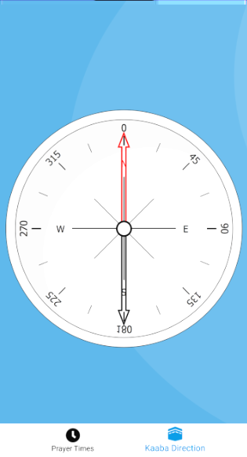

# Prayer App
- Get the Location of every prayer times 

- Architecture: MVVM

#Components: 
- Dagger
- Viewmodel 
- Room 
- Navigation from Jetpack 
- Coroutines 
- Constraint Layouts- Mockito
- Firebase Analytics, Git

  

  

  

 
